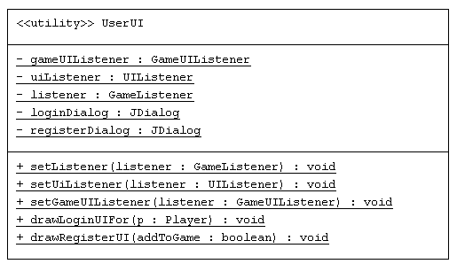
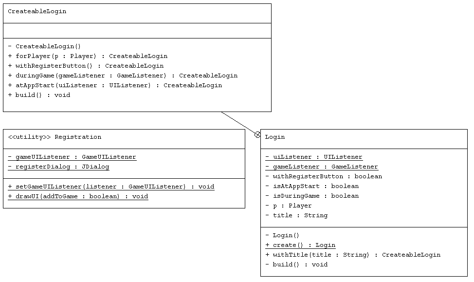

# Dokumentation ASE-Projekt
Philipp Rall, TINF18B2, 5844601

---

## Projektidee
Meine Idee ist mit Java ein kleines, lokales Desktop-Spiel „Tippduell“ nach dem Vorbild von Typeracer zu entwickeln. D.h. das Spielziel besteht darin, einen vorgegebenen Text möglichst schnell korrekt abzutippen.
In einem Wettkampfbereich soll hierzu zunächst die Schwierigkeit vom Spielleiter festgelegt werden, bevor ein entsprechender Text aus der Datenbank geladen wird.
Anschließend tippt ein Spieler nach dem anderen den Text ab, der schnellste gewinnt die Runde.
Neben dem Wettkampfbereich ist außerdem ein Bereich zur Spielerverwaltung sowie ein HighScore bzw. Statistikbereich pro Spieler angedacht, die Statistiken sollen ebenfalls in der Datenbank gespeichert werden.
Auch ein Trainingsbereich für Spieler ist geplant.

Generell dient die geplante Anwendung dem übergeordneten Zweck die Tippgeschwindigkeit der Spieler auf kompetitive Art und Weise zu trainieren und zu verbessern.

## Technologien
Die Anwendung ist in Java entwickelt, die Benutzeroberfläche basiert auf der in der Programmierenvorlesung erlernten Java-Swing-Technologie.  
Als Build-Management-Tool wird Maven verwendet, als Datenbank eine SQLite-Datenbank. 

## Programmierprinzipien
### SOLID
#### Single Responsibility Principle
Dieses Programmierprinzip sagt aus, dass jede Klasse nur eine Zuständigkeit, eine klar definierte Aufgabe besitzen soll.
Das ermöglicht niedrige Komplexität und Kopplung. So besitzt die Klasse `Session` lediglich die Zuständigkeit der Anmeldelogik, die durch die beiden Methoden
`login()` und `logoff` sowie das Attribut `loggedInPlayer` ausgedrückt wird. Ein weiteres Beispiel für die Einhaltung des Prinzips findet sich in den `Repository`-Klassen, von Game, Player, Stats oder Text. Diese haben jeweils nur die Aufgabe
die Datenbankzugriffe für ein konkretes Repository-Objekt abzubilden.
#### Open Closed Principle
Das Open Closed Prinzip beschreibt, dass Klassen generell offen für Erweiterungen und geschlossen für Änderungen sein sollten.
Durch Abstraktionen kann die Erweiterbarkeit gefördert werden, sodass bei Erweiterungen der bestehende Code nicht geändert werden muss.
#### Liskov Substitution Principle
Das Liskov Substitution Principle besagt, dass Objekte eines abgeleiteten Typs als Ersatz für Instanzen ihres Basistyps funktionieren müssen ohne die Korrektheit des Programms zu ändern.
Durch Einsatz des Prinzips können Invarianzen eingehalten werden.
In Tippduell erben die Klassen `GameStats` und `PlayerStats` von der Klasse `Stats`. Zur Einhaltung des Liskov Substitution Principles müssen `Stats`-Objekte ohne Probleme durch Objekte der abgeleiteten Klassen ersetzt werden können.
Dies ist möglich, da die Klasse `Stats` zu keinem Zeitpunkt instanziiert wird, sie ist abstrakt. Eine weitere Vererbung findet in der Anwendung keine Anwendung, daher kann dieses Prinzip nicht aufgezeigt werden.
#### Interface Segregation Principle
Dieses Programmierprinzip sagt aus, dass Anwender nicht von den Funktionen abhängig sein sollten, die sie nicht nutzen, und lässt sich durch passgenaue Interfaces realisieren.
In der vorliegenden Anwendung werden ausschließlich passgenaue Interfaces verwendet, da diese jeweils nur von einer Klasse implementiert werden und lediglich im Rahmen des *Listener-Patterns* zum Einsatz kommen.
Als Beispiel hiefür kann das `GameListener`-Interface angeführt werden, es wird nur von der Klasse `Game` implementiert und ist daher passgenau auf die benötigten Funktionen zugeschnitten.
Somit ist dieses Prinzip erfüllt.
#### Dependency Inversion Principle
Das Dependency Inversion Principle verlangt, dass High-Level-Module nicht von Low-Level-Modulen, sondern beide von Abstraktionen abhängig sein sollten.

### GRASP
GRASP steht für General Responsibilty Assignment Software Patterns und bezeichnet eine Sammlung an Basisprinzipien. Von diesen soll zwei im Folgenden behandelt werden.
#### Low Coupling
Low Coupling verlangt eine geringe bzw. lose Kopplung zwischen Objekten, d.h. diese weisen nur geringe Beziehungen auf. Dadurch liegen nur geringere Abhängigkeiten vor, der Code wird verständlicher und einfach wiederverwendbar.
Ein Beispiel für `Low Coupling` ist die Klasse `Round`, die lediglich eine Beziehung zu einem `GameListener` aufweist, um diesen über das Ende der Runde zu benachrichtigen, sowie eine Beziehung zu ihrer Benutzeroberfläche 
durch den Aufruf der statischen Methoden von `RoundUI` aufweist und zu `Text`. Diese Beziehung ist notwendig, um die Runde mit einem Text darzustellen.
#### High Cohesion
Kohäsion ist allgemein ein Maß für den Zusammenhalt einer Klasse und beschreibt die semantische Nähe der Elemente einer Klasse. High Cohesion erfordert somit, eine hohe semantische Nähe aller Klassenelemente.
Eine hohe Kohäsion lässt sich vor allem in den UI-Klassen wiederfinden, da grundsätzlich für jeden Bestandteil der Benutzeroberfläche eine eigene Klasse existiert. So ist beispielsweise die Klasse `RoundUI` nur für die Darstellung der Benutzeroberfläche einer Runde zuständig und besitzt dafür die beiden 
Methoden `displayRoundFor` und `closeRound`. Ein anderes Beispiel stellt die Klasse `Registration` dar, die nur eine Methode `drawUI` aufweist, die die Benutzeroberfläche zu Registrierung zeichnet.
Aber auch in Klassen wie `Rules` oder `Player` zeigt sich eine hohe Kohäsion. 

### DRY
DRY ist eine Abkürzung für *Don't Repeat Yourself!* und versucht jegliche unnötige Duplikation zu vermeiden.  
Eine Anwendung des Prinzips ist in der Darstellung der Anmeldebenutzeroberfläche in der Klasse `Login` zu finden. Diese muss an drei verschiedenen Stellen im Programm leicht verändert dargestellt werden (Programmstart, Rundenstart je Spieler, Spielende).
Statt den Code dreimal zu wiederholen, wurde auf das Builder-Pattern gesetzt. D.h. es werden zunächst die Parameter der benötigten Darstellung gesammelt und es wird dann einmal in der `build`-Methode die Oberfläche erzeugt.  

Ein weiteres Beispiel ist die Klasse `Game` bzw. auch das `GameUI`. Ein spiegelt grundsätzlich sowohl einen Wettkampf als auch ein Trainingsspiel wider und wird hierfür ebenfalls sinnvoll wiederverwendet.
Durch das Attribut `isCompetition` kann eine Unterscheidung vorgenommen werden, es muss kein Code dupliziert werden.

## Entwurfsmuster
Als Entwurfsmuster wurden im Tippduell zum einen das **Builder-Pattern** und zum anderen das **Observer-Pattern** bzw. **Listener-Pattern** angewandt. 
### Builder-Pattern
Grundsätzlich handelt es sich beim Builder-Pattern um ein Muster zur einfachen und schrittweisen Erstellung von komplexen Objekten in unterschiedlichen Ausführungen. In der Anwendung wird das Builder-Pattern nicht direkt zur Erstellung 
von `Login`-Objekten bzw. Login-UIs eingesetzt. Diese werden in drei verschiedenen Abwandlungen in der Anwendung eingesetzt, daher ist der Einsatz des Builder-Patterns sinnvoll. Zudem erhöht das Builder-Pattern deutlich die Lesbarkeit und damit Wartbarkeit des Codes.

[Aufrufe ohne Builder-Pattern](https://github.com/Ralerus/ASE_Project/tree/38c49087568b1a93d41e891a76e28d8d1446096b):
- Anmeldung in `ApplicationUI` zu Programmstart: `UserUI.setUIListener(this); UserUI.drawLoginFor(null);`
- Anmeldung in `Game` für nächsten Spieler: `UserUI.setListener(this); UserUI.drawLoginUIFor(nextPlayer);`
- Anmeldung in `Game` für Spielleiter: `UserUI.setListener(this); UserUI.drawLoginFor(originallyLoggedInPlayer);`

[Aufrufe mit Builder-Pattern](https://github.com/Ralerus/ASE_Project/commit/2178f80aeb50db3e314c6a9b14cd96ad0e73de99):
- Anmeldung in `ApplicationUI` zu Programmstart: `Login.create().withTitle("Anmeldung").atAppStart(this).withRegisterButton().build();`
- Anmeldung in `Game` für nächsten Spieler: `Login.create().withTitle("Anmeldung des nächsten Spielers").forPlayer(nextPlayer).duringGame(this).build();`
- Anmeldung in `Game` für Spielleiter: `Login.create().withTitle("Anmeldung des Spielleiters für Ergebnisse").forPlayer(originallyLoggedInPlayer).build();`

Durch das Builder-Pattern besteht nun auch die Möglichkeit einfach den Titel des Login-Dialogs anzupassen, so wird für den/die Nutzer*in klarer, wofür der aktuelle Dialog dient.
Durch das eingesetzte Builder-Pattern ist nun auch gewährleistet, dass immer ein Listener gesetzt wird, sofern dieser benötigt wird. Dies geschieht in einem Methodenaufruf (z.B. `duringGame(this)`) und nicht mehr in zwei, wie zuvor.
Da in diesem Beispiel lediglich einen konkreten Erbauer gibt, kann auf weitere Interfaces verzichtet werden. Zudem gibt die `build`-Methode kein Objekt zurück, sondern zeichnet das entsprechende UI. Deshalb wird auch für das letztendliche Produkt
kein Interface benötigt.

UML-Diagramm vorher:  
  
Vor der Einführung des Patterns war die `UserUI`-Klasse für die Darstellung von Login und Registration verantwortlich, was zunächst auch einmal gegen das
Single-Responsibility-Prinzip verstößt. 

UML-Diagramm nachher:  

Danach gibt es für die beiden Aufgaben zwei separate Klassen `Registration` und `Login`. Für `Registration` lohnt sich der
Einsatz des Builder-Patterns nicht, da diese lediglich zwei verschiedene Ausprägungen aufweist.

### Listener-Pattern
Es handelt sich hierbei um ein Verhaltensmuster, also einem Pattern zur Kommunikation zwischen Objekten und der Steuerung des Kontrollflusses einer Anwendung zur Laufzeit.
Das Listener-Pattern ermöglicht eine automatische Reaktionen auf Zustandsänderungen und wird in der vorliegenden Anwendung für die Kommunikation zwischen Benutzeroberfläche und Applikationslogik eingesetzt.

Ein Interface wie beispielsweise `GameListener` gibt verschiedene Methoden vor, wie beispielsweise `startRoundFor(Player p)`, die die `Game`-Klasse implementiert.
Die Klasse `Login` bekommt über die `duringGame(GameListener g)`-Methode dann eine Game-Instanz als privaten Member gesetzt, über den das `Login` bei Bedarf die erwähnte Methode aufrufen kann.
Die Klasse `Game` ist somit ein Observer, die Klasse `Login` ein Observable, das den Observer über die `startRoundFor(Player p)`-Methode benachrichtigen kann. 
Hierfür muss sich eine Instanz der Game-Klasse auf dem `Login` während des Buildprozesses registrieren.
Da das Login nach dem Builder-Pattern erzeugt wird, liegt keine klassische Implementierung des Listener-Patterns vor, so gibt es z.B. keine Methode `addListener`.
Das kommt auch daher, da jedes Login nur maximal einen `Game`-Observer besitzen kann.

## Domain Driven Design

## Architektur
Das vorliegende Programm wurde in einer Schichtenarchitektur mit den drei Schichten *Presentation*, *Domain* und *Data* entwickelt.
Jede Schicht deckt dabei einen unterschiedlichen Aufgabenbereich ab:
- **Presentation**: Klassen zur Darstellung der Benutzeroberfläche, z.B. `GameUI`, `SettingsUI` oder `RoundUI`.
- **Domain**: Klassen für die eigentliche Spiellogik, steuern Spielfluss maßgeblich, z.B. `Game` oder `Round`.
- **Data**: Klassen für grundlegende Objekte der Anwendung, z.B. `Player`, `Text` oder `Stats` mit den dazugehörigen Repositories. Die Repositories wie z.B. das `PlayerRepository` beinhalten
  Code zum Verwalten der dazugehörigen Datenbankobjekte. In dieser Schicht werden alle Datenbankzugriffe realisiert, diese können dadurch für die obigen Schichten durch Methodenaufrufe auf den Repositories abstrahiert werden.
Dabei gilt allgemein, dass jede Schicht nur von den unterliegenden Schichten abhängt und somit unabhängig von den überliegenden Schichten ist. Konkret bedeutet das, dass 
  beispielsweise die *Data*-Schicht unabhängig von den anderen beiden Schichten ist, die oberen beiden Schichten aber Methoden der *Data*-Schicht verwenden.
  
Die Entscheidung viel auf diese Art der Schichtenarchitektur, da sie gut zur Anwendung passt.

## Unit Tests

## Refactoring

### Large Class & Long Method
Ein Code Smell, nämlich eine Large Class mit Long Methods, kann in der `SettingsUI`-Klasse hierdurch identifiziert werden. Diese Klasse beinhaltet den UI-Code
für die Nutzerverwaltung und Textverwaltung mit jeweils einer langen Methode für die beiden Bereiche. Allein durch diese Beschreibung wird klar, dass die Klasse nicht dem Single Responsiblitiy Prinzip folgt.
Deshalb soll in drei Schritten ein Refactoring durchgeführt werden, der Erfolg des Refactorings der Long Methods wird durch die Codezeilen pro Methode gemessen.
1. Zunächst muss die Klasse `SettingsUI` in zwei Klassen `UserManagementUI` und `TextManagementUI` aufgeteilt werden. Diese Aufteilung ist
   in [diesem Commit](https://github.com/Ralerus/ASE_Project/commit/e33955c28d18d9d8b755d1edd9c3099472b45b3e) zu sehen. So kann sichergestellt werden, dass jede Klasse nur eine Aufgabe innehat.
2. Anschließend kann das Long Method-Problem mittels Extract-Method-Refactoring angegangen werden und in `UserManagementUI` die lange Methoden `getUserManagementUI` in kleinere Methoden
   aufgeteilt werden, sodass jede Methode nur eine Aufgabe erfüllt. Dieser Zwischenstand ist in [diesem Commit](https://github.com/Ralerus/ASE_Project/commit/34447a0c0f96d04d599d24a7e31f3b98d9e2949b) sichtbar. 
   So konnte die `getUserManagementUI` Methode mit 149 Zeilen Code in neun Methoden mit jeweils maximal 38 Zeilen Code aufgeteilt werden. Das steigert die Lesbarkeit und Wartbarkeit erheblich.
   Ein ähnlicher Effekt konnte in der `TextManagementUI`-Klasse erzielt werden, dort ließ sich die lange Methode mit ursprünglich 151 Codezeilen in elf kleine Methoden mit maximal 36 Codezeilen aufgeteilt werden.
   Siehe hierzu [diesen Commit](https://github.com/Ralerus/ASE_Project/commit/92613710b839de591c9b3e2e2ebebea8128c62a8).
3. Allerdings ist das Ergebnis im Bereich des User-Managements noch nicht zufriedenstellend, es fällt auf, dass Methoden wie `changeUsernameIfNotEmpty` eigentlich kein UI-Code, sondern Domain-Code sind. 
   Deshalb sollen diese Methoden in einer neuen Klasse `UserManagement` in der domain-Schicht zusammengefasst werden. Außerdem ist eine Umbenennung sinnvoll, da diese nach dem Refactoring lediglich einen Wahrheitswert zurückliefern,
   ob die Änderung erfolgreich war bzw. ob die Eingabefelder im UI geleert werden sollen. Die Methoden heißen deshalb z.B. `isUsernameChaned`. Siehe hierzu [diesen Commit](https://github.com/Ralerus/ASE_Project/commit/06659658d79ade7ebb4075a389f87117968bc6fe).

### Code Style
Zur objektiven, metrikbasierten Identifikation von Code Smells wird für dieses Projekt das Analysetool *Codacy* eingesetzt. Anhand des Quality-Scores dort, kann der konkrete
Erfolg des Refactorings bewertet werden. Im zweiten Refactoring sollen die in Codacy aufgezeigten Issues bezüglich Code-Style und Fehleranfälligkeit angegangen werden.
Zu Beginn des Refactorings liegen 55 Issues vor, davon 43 Code-Style-Issues und 12 Error-Prone-Issues. [Hier](https://app.codacy.com/gh/Ralerus/ASE_Project/dashboard?branch=main) kann das Codacy-Dashboard eingesehen werden.
Ziel des Refactorings ist es, alle Issues zu lösen, um einen guten Code-Style und geringe Fehleranfälligkeit zu ermöglichen.

Folgende Probleme konnten dabei behoben werden:
- Entfernung bzw. Ersetzung ungenutzer Imports oder unnötiger Import-Alls (*)
- Entfernung von Logik-Inversionen, aus `!(a==b)` wird `(a!=b)`
- Reduzierung der Anzahl globaler Variablen, Umwandlung zu lokalen Variablen, wenn sinnvoller (z.B. `rule` in `Game` oder `endTime` in `Round`)
- Objektvergleiche mit != wurden durch equals ersetzt
- Kombination von unnötig verschachtelten If-Statements wie in `UserManagement`

